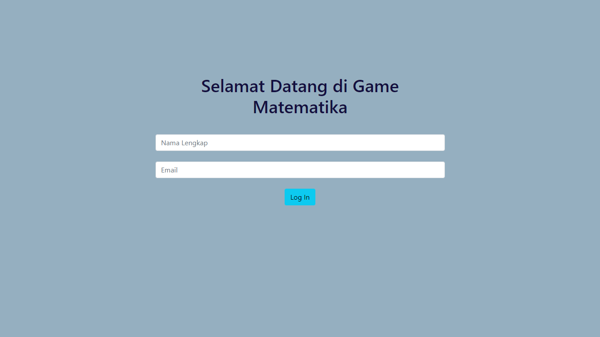
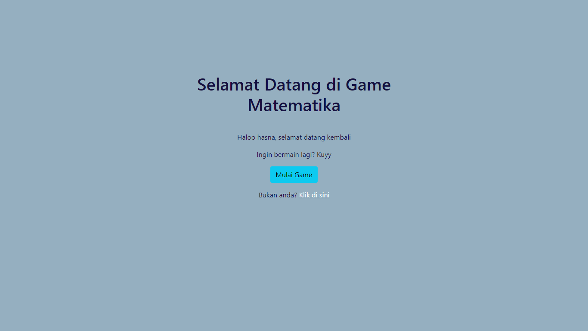
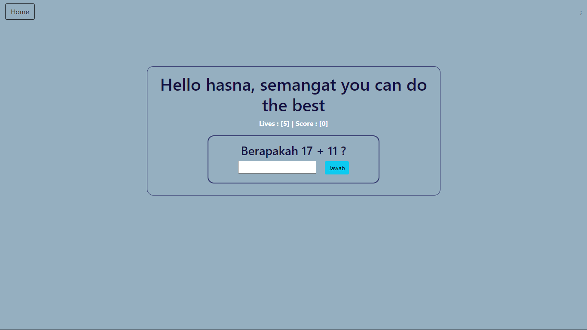
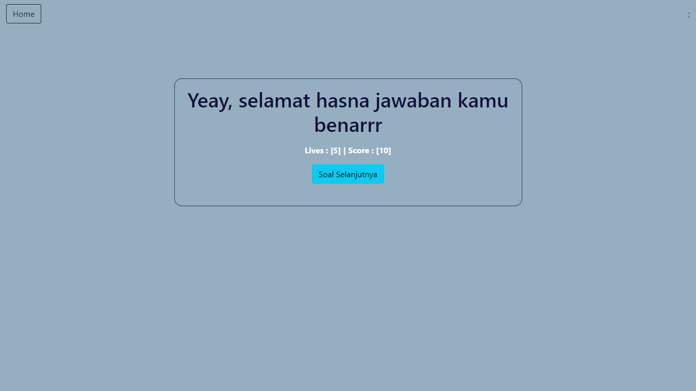
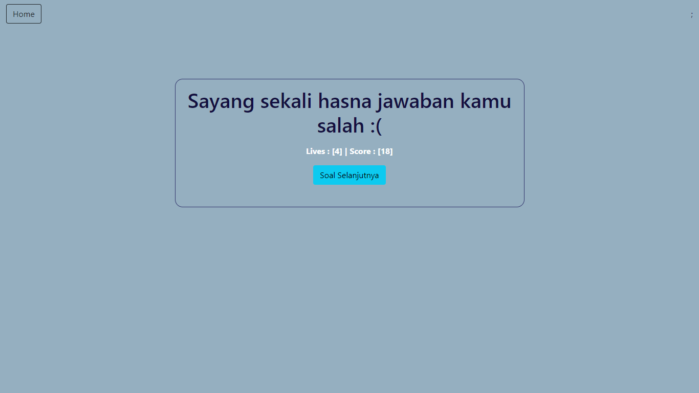

# UTS PEMROGRAMAN WEB
# Tugas Membuat Game sederhana
## Hasna Madikha K3519037

Web Game matematika sederhana ini dibuat dengan bahasa PHP, html, dan mysql untuk memenuhi tugas UTS mata kuliah Pemrograman Web. Tampilan awal dari web ini adalah form login yg digunakan untuk menginput data agar lebih mudah dikelompokkan dan dirapikan. pada game ini, menggunakan framework bootstrap 5 untuk mempermudah dalam membentuk grid. Setelah login, akan ada soal pertanyaan yang harus dijawab dan pemain diberi 5 nyawa yang jika habis nyawanya akan ada game over. Dan tercatat di hall of fame, yaitu tabel yang menampilkan daftar pemain dengan urutan skor tertinggi.

 

# **Tampilan Awal Website**

# **Tampilan Website Setelah Login**

# **Tampilan Awal Game

# **Tampilan Ketika Menjawab Dengan Benar**

# **Tampilan Ketika Menjawab Dengan Salah**

# **Tampilan Ketika Nyawa Sudah Tersisa 0**

 

## Link Website : http://www.oxoppl.epizy.com/
